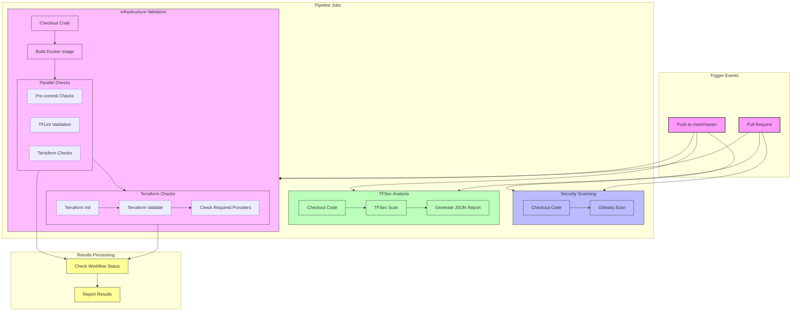

### Hello and welcome,

I'm Yaar Naumenko - Cloud Infra Engineer and Solutions Architect.

Please look at the code examples and diagrams of some projects released below. 

[Pre-commit checks pipeline](https://github.com/cloudon-one/pre-commits-pipelines)

[Kubernates (EKS) Essential Platform Tools - scalable and preconfigured Terragrunt configuration](https://github.com/cloudon-one/k8s-platform-tools)

[k8s platform modules](https://github.com/cloudon-one/k8s-platform-modules)

[AWS Multi-Account Landing Zone with Terragrunt and Terraform](https://github.com/cloudon-one/aws-terragrunt-configuration)

[Multi-tenant, scalable and isolated GCP Cloud Landing Zone](https://github.com/cloudon-one/snippet)

[AWS FinOps Idle Resources Cleaner](https://github.com/cloudon-one/aws-cleaner)

[GCP FinOps Resources Recommender](https://github.com/cloudon-one/gcp-finops-recommender)

[OpenAI applications samples -  API, AI assistant and vision](https://github.com/cloudon-one/genai)

[DevSecOps Best Practices and resources](https://github.com/cloudon-one/DevSecOps)

[List of selected k8s resources](https://github.com/cloudon-one/k8s-resources)

[Cloud DevOps Essentials](https://github.com/cloudon-one/devops-toolset) 

[HCP Vault on GCP and AWS terraform template](https://github.com/cloudon-one/vault)

[GCP terraform resources](https://github.com/cloudon-one/gcp-terraform-resources) 

[AWS terraform resources](https://github.com/cloudon-one/aws-tf-modules) 

